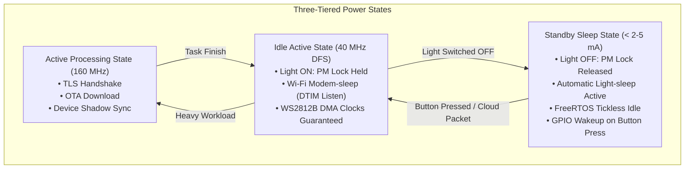

# ADR-008: Power Management Architecture — Dynamic Frequency Scaling, Automatic Light-sleep, and Per-Peripheral PM Locks

## Status
Accepted

## Context
Commercial smart lighting devices must comply with international energy efficiency standards (such as Energy Star, EU ErP Tier 2) requiring standby power consumption under **0.5 W** (equivalent to less than **15–20 mA** at 5V, or under **5 mA** at 3.3V for the MCU system).

In previous chapters:
- The ESP32-C3 / ESP32-S3 CPU ran continuously at fixed frequency (160 MHz).
- The WS2812B NeoPixel 8-LED strip was driven via Hardware SPI2 DMA @ 3.2MHz on GPIO 4.
- FreeRTOS tick interrupts fired every millisecond (1000 Hz), preventing the chip from entering low-power sleep states.
- Wi-Fi radio consumed 70–120 mA continuously even when idle.

However, enabling aggressive power saving introduces severe hardware challenges:
1. **Clock Disruption on Light Driver**: If the CPU enters Light-sleep or scales APB frequency while the LED strip is actively being driven, the peripheral clocks halt or fluctuate, leading to LED flickering, color corruption, or bus timeouts.
2. **Interactive Latency**: If the device enters deep sleep, waking up requires a full system reset (~200 ms), breaking the seamless UX of a physical wall switch.
3. **Network Disconnection**: If the modem is disabled entirely, cloud synchronization (ESP RainMaker) and LAN control (HTTPS/mDNS) fail.

## Decision
We implement a three-tiered power optimization architecture coordinated through an explicit Power Management Lock:

1. **Dynamic Frequency Scaling (DFS)**:
   - Configured via `esp_pm_configure(&pm_config)` with unified `esp_pm_config_t`.
   - Max CPU frequency: **160 MHz** (high throughput for crypto, TLS, and RainMaker shadow parsing).
   - Min CPU frequency: **40 MHz** (matches external crystal oscillator frequency XTAL, lowering dynamic switching power).

2. **Automatic Light-sleep & FreeRTOS Tickless Idle**:
   - Enabled via `CONFIG_PM_ENABLE=y` and `CONFIG_FREERTOS_USE_TICKLESS_IDLE=y`.
   - When all FreeRTOS tasks are blocked waiting for events, the RTOS timer stops the system tick and programs the RTC timer to wake the system before the next scheduled task or Wi-Fi beacon.
   - CPU and high-speed clocks are gated, dropping current consumption to under **2–5 mA**.

3. **Power Management Lock (`ESP_PM_NO_LIGHT_SLEEP`)**:
   - A dedicated lock `s_light_pm_lock` ("light_led_lock") is created at boot.
   - **Acquire (`app_pm_lock_acquire`)**: Whenever the light is turned **ON** (via physical button single/double click or cloud/LAN parameter write), the lock is acquired. This strictly prohibits entering Light-sleep, ensuring stable APB clocking and instantaneous DMA transfers.
   - **Release (`app_pm_lock_release`)**: Whenever the light is turned **OFF**, the lock is released. The system immediately becomes eligible for Automatic Light-sleep.

4. **Instantaneous Button Wakeup via GPIO**:
   - `gpio_wakeup_enable(LIGHT_BUTTON_GPIO, GPIO_INTR_LOW_LEVEL)` and `esp_sleep_enable_gpio_wakeup()` configure the hardware Boot button as a wake-up source.
   - When the user presses the button in sleep mode, the MCU wakes up in under **1 ms**, acquires the PM lock, and turns on the LED without perceived latency.

## Consequences

### Positive
- **Dramatic Energy Reduction**: Standby current when light is OFF drops from ~80 mA to **< 2–5 mA**, exceeding commercial standby requirements.
- **Zero LED Artifacts**: The `ESP_PM_NO_LIGHT_SLEEP` lock guarantees that DMA and APB clocks are never stopped or degraded while the light is active.
- **Zero UX Latency**: Physical button wakes the chip instantaneously from Light-sleep without rebooting.
- **Full Dual-Target Compatibility**: ESP32-C3 and ESP32-S3 share identical power management logic via unified `esp_pm_config_t`.

### Negative / Trade-offs
- FreeRTOS tick timing precision is slightly lower during sleep transitions (acceptable for IoT devices).
- Slight increase in code complexity due to PM lock state tracking (`g_pm_lock_acquired`).

## Compliance Verification
- Automated compilation verified on both `esp32c3` and `esp32s3`.
- Archify interactive architecture diagram compiled and validated (Showcase Profile: 9/9 PASS, 0 errors, 0 warnings).
- Hardware monitor instrumentation verifies lock acquisition on ON and release on OFF.
