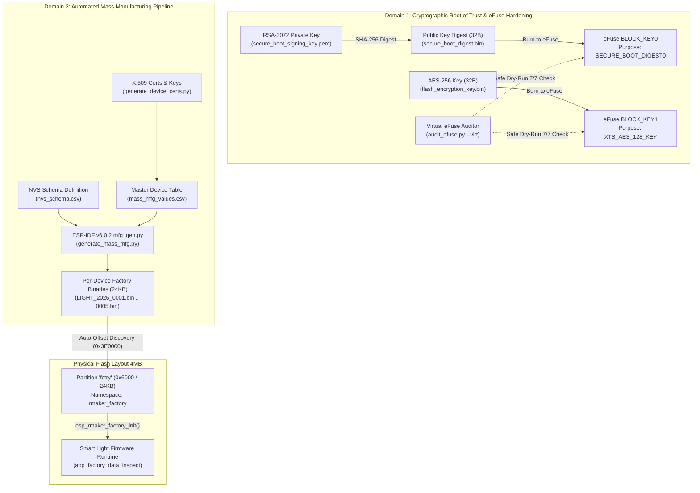

# ADR-009: Hardware Security Hardening (Secure Boot v2, Flash Encryption) and Automated Mass Production Pipeline

## Status
Accepted

## Context
Transitioning the PBL5 Smart Light project from prototype development to commercial mass manufacturing requires solving two fundamental industrial challenges:
1. **Intellectual Property & Credential Protection**:
   - Firmware binaries stored in external SPI Flash are vulnerable to physical extraction, reverse engineering, and counterfeit cloning via SPI bus sniffing or ROM bootloader dump.
   - Cloud credentials, TLS private keys, and Wi-Fi credentials stored in NVS can be extracted by an attacker with physical access to the device.
2. **Per-Device Unique Manufacturing Data (Factory Provisioning)**:
   - Every commercial device rolling off the assembly line must carry unique identity parameters: MAC address, Serial Number, device-specific TLS private key, and X.509 device certificate in the `fctry` partition.
   - Modern ESP-IDF v6.0.2 introduced restructured utilities (`mfg_gen.py`), requiring a standardized, automated manufacturing toolchain that eliminates manual human errors on the assembly line.
3. **Hardware Preservation in Development**:
   - Burning physical eFuses on ESP32-C3 / ESP32-S3 is an **irreversible, one-time operation (OTP)**. Inadvertently burning production eFuses during development can permanently lock out JTAG debugging, disable serial flashing, or brick engineering samples.

## Decision
We architected a unified dual-domain security and mass manufacturing framework:

### 1. Cryptographic Security Architecture (Chapter 13)
1. **Secure Boot v2 (RSA-3072)**:
   - Private key generated via `espsecure generate-signing-key --version 2 --scheme rsa3072`.
   - 32-byte SHA-256 public key digest extracted via `espsecure digest-sbv2-public-key` and burned into eFuse `BLOCK_KEY0` with `KEY_PURPOSE_0 = SECURE_BOOT_DIGEST0`.
   - Bootloader ROM verifies RSA signature block prepended to bootloader and application before handing over execution.
2. **Hardware Flash Encryption (AES-XTS)**:
   - 256-bit random key generated via `espsecure generate-flash-encryption-key` and burned into `BLOCK_KEY1` (`XTS_AES_128_KEY`).
   - Hardware AES-XTS transparently encrypts and decrypts SPI bus traffic at bus speed with zero CPU overhead.
   - `SPI_BOOT_CRYPT_CNT` eFuse controls activation (1 bit for development with re-encryption, 3 bits for release lockdown).
3. **Safe Virtual Simulation Mode**:
   - `tools/security/audit_efuse.py` runs in `--virt` mode by default, evaluating compliance against 7 critical security fuses without modifying physical hardware.

### 2. Mass Manufacturing Pipeline (Chapter 14)
1. **NVS Schema Standardization**:
   - Standardized 3-column CSV schema (`tools/mass_mfg/nvs_schema.csv`) beginning with namespace entry `rmaker_factory,namespace,`.
   - Maps fields `serial_no` (string), `mac_addr` (hex2bin), `priv_key` (binary file), and `node_cert` (binary file).
2. **Automated Multi-Device Partition Generator**:
   - Script `tools/mass_mfg/generate_mass_mfg.py` orchestrates `$IDF_PATH/tools/mass_mfg/mfg_gen.py` to produce standardized 24KB (`0x6000`) images.
   - Supports per-device NVS encryption (`--encrypt`), generating paired partition images and individual encryption keys (`keys-LIGHT_xxxx.bin`).
3. **Dynamic Offset Discovery & Flashing Tool**:
   - `tools/mass_mfg/flash_factory_data.py` auto-parses `partitions.csv` to resolve dynamic partition offsets (`0x3e0000` for 1920KB dual OTA layout or `0x340000` for legacy layouts).
   - Provides safe `--dry-run` validation before driving `esptool.py`.

### 3. Firmware Integration
- `device_firmware/6_project_optimize/main/app_main.c` integrates `app_factory_data_inspect()`:
  - Invokes `esp_rmaker_factory_init()` to mount the `fctry` partition.
  - Queries `esp_rmaker_factory_get("serial_no")` and `esp_rmaker_factory_get("mac_addr")`, logging device credentials on startup.

## Consequences

### Positive
- **Tamper-Proof Hardware**: Cloned firmware images fail RSA signature verification and will not boot. Extracted flash contents appear as random noise under AES-XTS.
- **Automated Production Line**: Assembly line operators run a single deterministic command `python flash_factory_data.py --device LIGHT_2026_xxxx --port COMx` without manual offset math.
- **Zero Risk to Development Kits**: Default virtual eFuse simulation protects engineering boards from irreversible OTP fuse burns.
- **Dual-Target Verified**: Both ESP32-C3 and ESP32-S3 compile cleanly with 8% and 27% flash headroom respectively.

### Negative / Trade-offs
- Secure Boot adds ~4.4KB signature block overhead per binary.
- Once release-mode eFuses are physically burned, JTAG debugging and unauthorized firmware flashing are permanently blocked.
