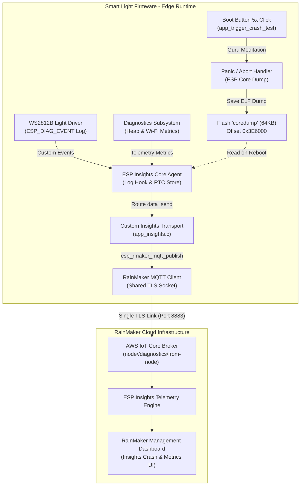

# ADR-010: Remote Observability, Diagnostics, and Crash Telemetry via ESP Insights & RainMaker Shared MQTT Transport

## Status
Accepted

## Context
Deploying smart lights in enterprise and consumer environments exposes firmware to unpredictable field conditions: unexpected memory exhaustion (Heap Leaks), Wi-Fi degradation (Weak RSSI / RF interference), and unhandled kernel panics (Guru Meditation / NULL Pointer Dereference / Watchdog Timeout). Traditional local UART debugging is inaccessible once devices are deployed in ceilings or fixtures.

To achieve industrial-grade field observability without degrading system performance, three core engineering challenges must be addressed:
1. **SRAM Scarcity & Dual-TLS Overhead**:
   - ESP Insights natively supports reporting over HTTPS or an independent MQTT connection.
   - Initializing a second TLS/TCP socket for telemetry consumes **30–40 KB of precious internal SRAM**, which can easily induce heap exhaustion when combined with BLE NimBLE stack and RainMaker core services.
2. **Crash Dump Persistence & Retrieval**:
   - When a firmware panic occurs, volatile memory is wiped upon chip reboot.
   - The system requires a dedicated Flash partition to store an ELF-formatted core dump during the fatal panic handler, and an automated agent to upload the dump to the Cloud immediately upon network reconnection.
3. **Partition Table 4MB Boundary & 64KB Alignment**:
   - Dual OTA slots (`ota_0`, `ota_1`), manufacturing credentials (`fctry`), and core dumps (`coredump`) must all fit within standard 4MB SPI Flash without violating 64KB erase sector boundaries.

## Decision
We engineered a unified remote observability framework integrating ESP Insights with ESP RainMaker:

### 1. Shared RainMaker MQTT Transport Architecture (Section 15.3.1)
Instead of allocating a second TLS connection, `app_insights.c` implements a custom transport registered via `esp_insights_transport_register()`:
- **Zero TLS Overhead**: Reuses RainMaker's authenticated TLS MQTT socket, reducing peak RAM consumption by ~35 KB.
- **Asynchronous Publish & Event Bridge**:
  - Outgoing telemetry is dispatched through `esp_rmaker_mqtt_publish()` to topic `node/<node_id>/diagnostics/from-node` with QoS 1.
  - Event listener on `RMAKER_COMMON_EVENT` catches `RMAKER_MQTT_EVENT_PUBLISHED` and converts it into `INSIGHTS_EVENT_TRANSPORT_SEND_SUCCESS` to complete the acknowledgment cycle.
- **Enabled Log Types**: Filtered for `ESP_DIAG_LOG_TYPE_ERROR | ESP_DIAG_LOG_TYPE_WARNING | ESP_DIAG_LOG_TYPE_EVENT`.

### 2. Quantitative System Metrics & Custom Events (Section 15.3.2)
- **Automated Health Telemetry**: Enabled via Kconfig (`CONFIG_DIAG_ENABLE_METRICS=y`, `CONFIG_DIAG_ENABLE_HEAP_METRICS=y`, `CONFIG_DIAG_ENABLE_WIFI_METRICS=y`, `CONFIG_DIAG_ENABLE_VARIABLES=y`). Automatically logs Free Heap, Min Free Heap, and Wi-Fi RSSI.
- **Domain-Specific Custom Events**:
  - `app_driver.c` instruments `ESP_DIAG_EVENT("LIGHT_EVENT", ...)` on power toggles, HSV hue cycles, and brightness changes, providing an audit trail of user interactions leading up to any field failure.

### 3. Flash-Based Core Dump & Artificial Crash Testing (Section 15.3.3)
- **ELF Core Dump Engine**: Configured via `CONFIG_ESP_COREDUMP_ENABLE_TO_FLASH=y` and `CONFIG_ESP_COREDUMP_DATA_FORMAT_ELF=y` to store task states, registers, and call stacks into the `coredump` partition.
- **Automated Cloud Upload**: On reboot, the Insights agent inspects the `coredump` partition, parses the backtrace summary, transmits it to the Cloud, and invalidates the partition slot.
- **Field Crash Verification Mechanism**: A 5-click repeat gesture on the Boot button (`BUTTON_PRESS_REPEAT` >= 5) triggers `app_trigger_crash_test()`, deliberately dereferencing a NULL pointer (`*null_ptr = 0xDEADBEEF`) to verify that the panic handler correctly persists and transmits the crash dump.

### 4. 4MB Flash Layout Optimization
To accommodate dual OTA slots, manufacturing credentials, and crash dumps, the partition table was optimized:
- `ota_0` & `ota_1`: 1920KB (`0x1E0000`) each, preserving 64KB sector alignment at `0x20000` and `0x200000`.
- `fctry`: 24KB (`0x6000`) at `0x3E0000`.
- `coredump`: 64KB (`0x10000`) at `0x3E6000`.
- Total used space: `0x3F6000` (3960 KB), leaving 40 KB safety reserve within 4MB Flash (`0x400000`).

## Consequences

### Positive
- **Field Visibility**: Remote diagnosis of field failures, memory leaks, and Wi-Fi dropouts directly via the RainMaker Dashboard without physical access.
- **Extreme Memory Efficiency**: Shared MQTT socket saves 30–40 KB RAM, ensuring the firmware operates comfortably alongside BLE NimBLE provisioning and local HTTPS control.
- **Actionable Crash Reports**: ELF core dump enables automatic stack backtrace symbolization against ELF binaries generated during build (`7_insights.elf`).
- **Complete Architecture Continuity**: 100% preservation of Local Control, Remote Control, OTA Rollback, DFS Power Management, and Mass Manufacturing factory credentials.

### Negative / Trade-offs
- **Flash Space Pressure**: Adding `coredump` (64KB) required fine-tuning OTA partition sizes to 1920KB, leaving ~6% headroom for ESP32-C3 firmware. (For larger applications, 8MB Flash or `-Os` compiler optimization is recommended).
- **MQTT Bandwidth Consumption**: Continuous metrics upload consumes cloud bandwidth; throttled via `CONFIG_ESP_INSIGHTS_CLOUD_POST_MIN_INTERVAL_SEC=60` and `CONFIG_ESP_INSIGHTS_CLOUD_POST_MAX_INTERVAL_SEC=240`.
