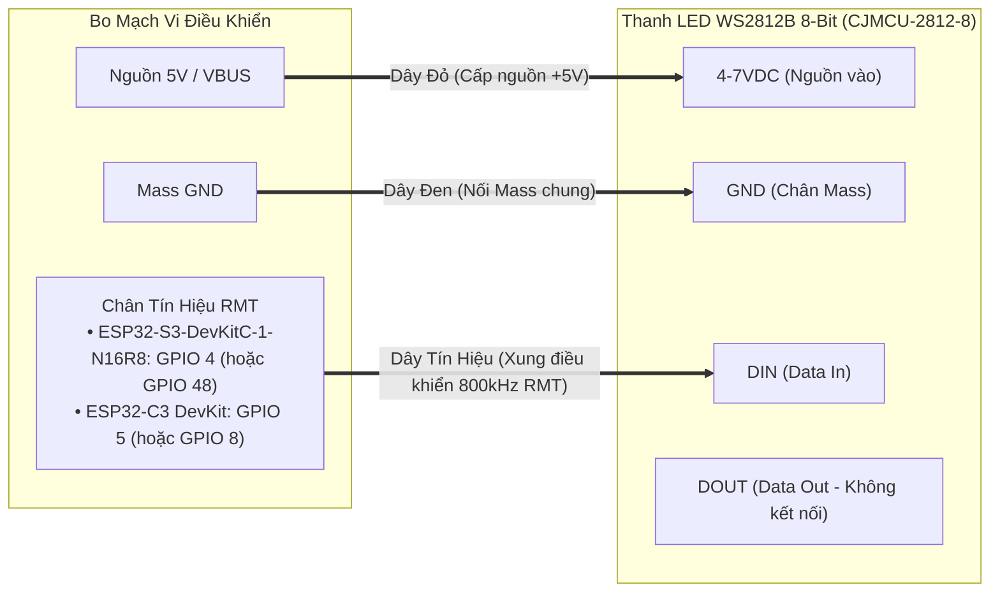
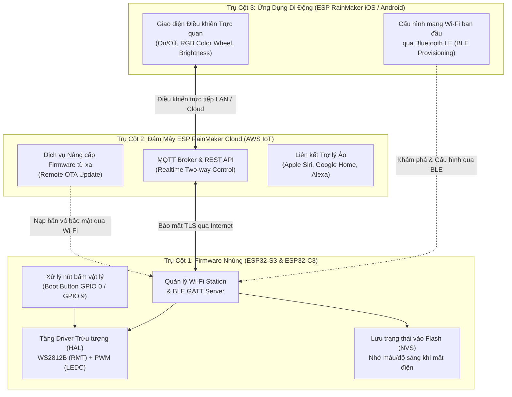
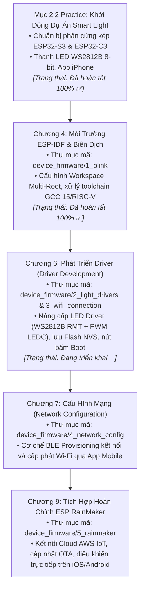

# Báo Cáo Tiến Trình: Mục 2.2 Thực Hành Đèn Thông Minh (Smart Light Project)

> **Căn cứ tài liệu**: Mục *2.2 Practice: Smart Light Project* — Sách *ESP32-C3 Wireless Adventure: A Comprehensive Guide to IoT* (Espressif Systems).  
> **Dự án**: PBL5 - Hệ Thống Đèn Thông Minh Đa Mục Tiêu (ESP32-S3 & ESP32-C3).  
> **Thời gian cập nhật**: 16/09/2026.

---

## 1. Mục Đích & Ý Nghĩa Của Mục 2.2 Practice

Mục **2.2 Practice: Smart Light Project** là điểm khởi đầu thực hành cho toàn bộ chuỗi dự án xuyên suốt cuốn sách. Mục đích cốt lõi bao gồm:
1. **Chuẩn bị hạ tầng toàn diện**: Đảm bảo đầy đủ phần cứng, môi trường lập trình nhúng, ứng dụng điều khiển trên điện thoại và kho mã nguồn chuẩn trước khi bước vào viết code chi tiết ở các chương sau.
2. **Định hình bức tranh tổng thể (Big Picture)**: Hiểu rõ kiến trúc sản phẩm cuối cùng gồm 3 trụ cột: **Thiết bị nhúng (Firmware)**, **Hạ tầng đám mây (ESP RainMaker Cloud)** và **Ứng dụng di động (Mobile App)**.

---

## 2. Bảng Kiểm Tiến Độ Chuẩn Bị (Readiness Checklist)

Dưới đây là bảng đối chiếu giữa yêu cầu lý thuyết trong sách và hiện trạng triển khai thực tế của nhóm:

| Hạng mục | Yêu cầu theo Sách | Hiện trạng Nhóm PBL5 | Trạng thái | Ghi chú kỹ thuật |
| :--- | :--- | :--- | :---: | :--- |
| **Bo mạch phát triển (MCU DevKit)** | ESP32-C3-DevKitM-1 | **Hỗ trợ kép (Dual-Target)**: • **ESP32-S3-DevKitC-1-N16R8** (Module ESP32-S3-WROOM-1, 16MB Flash, 8MB PSRAM Octal) • **ESP32-C3 DevKit** (Chưa rõ chủng loại cụ thể) | ✅ **SẴN SÀNG** | Đã cấu hình build matrix, target abstraction trong `1_blink` và `2_light_drivers`. |
| **Mô-đun Đèn LED** | Bóng đèn LED RGB analog (điều khiển bằng 3 kênh PWM riêng biệt) | **Thanh Đèn Led WS2812B 5050 RGB 8-Bit NeoPixel** (`CJMCU-2812-8`) | ✅ **SẴN SÀNG** | Cả hai bo mạch đều dùng chung 1 loại LED số WS2812B 8-bit, điều khiển qua ngoại vi **RMT**. |
| **Bộ định tuyến Wi-Fi** | Wi-Fi 2.4 GHz (802.11 b/g/n) | Wi-Fi Router băng tần 2.4 GHz sẵn sàng tại nơi làm việc | ✅ **SẴN SÀNG** | ESP32-S3 và ESP32-C3 đều chỉ hỗ trợ băng tần 2.4 GHz. |
| **Điện thoại thông minh** | Smartphone Android hoặc iOS | **iPhone (iOS)** + Smartphone Android | ✅ **SẴN SÀNG** | Đã cài đặt ứng dụng **ESP RainMaker** chính thức. |
| **Môi trường lập trình nhúng** | Máy tính cài đặt ESP-IDF (Linux, macOS, Windows) | **ESP-IDF v6.0.2** trên Antigravity IDE & VS Code Multi-Root Workspace | ✅ **SẴN SÀNG** | Đã cấu hình `pbl5.code-workspace`, sửa lỗi toolchain GCC 15 / RISC-V, biên dịch thành công 100%. |
| **Mã nguồn dự án** | Fork từ repo mẫu của Espressif | Repo GitHub nhóm: `phamdinhchien210104/PBL5_stevejobvn` (nhánh `main`) | ✅ **SẴN SÀNG** | Đã sửa lỗi NTFS Git clone trên Windows (ADR-002), đồng bộ Git remote origin hai chiều. |

---

## 3. Đặc Tả Phần Cứng: Thanh LED WS2812B 5050 RGB 8-Bit

### 3.1. Thông số thiết bị

- **Tên mô-đun**: Thanh Đèn LED WS2812B 5050 RGB 8-Bit NeoPixel (`CJMCU-2812-8`).
- **Sản phẩm tham chiếu**: [Lập Trình Nhúng A-Z: Thanh Đèn Led WS2812B 5050 RGB 8 Bit LED NEOPixel](https://shopee.vn/-L%E1%BA%ADp-Tr%C3%ACnh-Nh%C3%BAng-A-Z-G150-Thanh-%C4%90%C3%A8n-Led-WS2812B-5050-RGB-8-Bit-LED-NEOPixel-i.107147748.41179421389)
- **Model**: `CJMCU-2812-8`
- **Số lượng LED**: 8 bóng LED RGB SMD 5050 mắc nối tiếp.
- **IC điều khiển tích hợp**: WS2812B trong từng bóng LED, cho phép điều khiển độc lập màu sắc 24-bit (16.7 triệu màu) của từng bóng riêng lẻ.
- **Điện áp hoạt động**: $4.0\text{V} \sim 7.0\text{V}$ DC (Khuyên dùng $5\text{V}$ cấp từ chân `5V` / `VBUS` của bo mạch ESP32).

### 3.2. Sơ đồ các chân giao tiếp (Pinout Description)

Mô-đun có 2 đầu chân:

1. **Đầu vào tín hiệu (Input Side - Sử dụng kết nối với ESP32)**:
   - `GND`: Chân nối đất (Mass chung với ESP32).
   - `DIN` (Data In): Chân nhận dữ liệu điều khiển từ GPIO của ESP32.
   - `4-7VDC`: Chân cấp nguồn dương ($5\text{V}$).
   - `GND`: Chân mass phụ (nối chung với GND trên mạch).
2. **Đầu ra tín hiệu (Output Side - Nối tiếp)**:
   - `GND`, `DOUT`, `4-7VDC`, `GND`: Dùng để ghép tầng nối tiếp sang thanh LED tiếp theo nếu cần mở rộng thêm đèn. **Hiện tại dự án để trống đầu này**.

---

## 4. Sơ Đồ Đấu Dây Chi Tiết (Wiring Diagram)

Cả hai dòng bo mạch trong dự án đều kết nối tới **Thanh LED WS2812B 8-Bit NeoPixel** thông qua giao thức truyền dữ liệu số một dây, sử dụng ngoại vi **RMT (Remote Control)**.

### 4.1. Sơ đồ kết nối trực quan (Mermaid Diagram)

### 4.2. Bảng đấu nối chi tiết theo từng bo mạch

#### 1. Bo mạch ESP32-S3-DevKitC-1-N16R8 (Module ESP32-S3-WROOM-1):
ESP32-S3 sử dụng ngoại vi **RMT (Remote Control)** chuyên dụng để phát xung tín hiệu 800 kHz điều khiển WS2812B:

| Chân trên Thanh LED WS2812B | Chân trên ESP32-S3-DevKitC-1-N16R8 | Màu dây đề xuất | Mô tả chức năng |
| :--- | :--- | :--- | :--- |
| **GND** | **GND** | Dây Đen | Nối mass chung giữa nguồn và tín hiệu |
| **4-7VDC** | **5V** (hoặc `VBUS` / `VIN`) | Dây Đỏ | Lấy nguồn $5\text{V}$ trực tiếp từ cổng USB |
| **DIN** | **GPIO 4** *(hoặc GPIO 48)* | Dây Vàng / Xanh | Chân xuất dữ liệu kỹ thuật số tốc độ cao (RMT Channel) |

> [!TIP]
> **Lưu ý nguồn điện**: Khi bật đồng thời cả 8 bóng LED ở mức sáng tối đa (Màu trắng = R+G+B 100%), mỗi bóng tiêu thụ khoảng $60\text{mA}$, tổng dòng cho thanh 8-bit là khoảng $8 \times 60\text{mA} \approx 480\text{mA}$. Nguồn cấp $5\text{V}$ từ cổng USB máy tính hoặc củ sạc điện thoại hoàn toàn đáp ứng tốt mức công suất này.

#### 2. Bo mạch ESP32-C3 DevKit (Chưa rõ chủng loại cụ thể):

| Chân trên Thanh LED WS2812B | Chân trên ESP32-C3 DevKit | Màu dây đề xuất | Mô tả chức năng |
| :--- | :--- | :--- | :--- |
| **GND** | **GND** | Dây Đen | Nối mass chung |
| **4-7VDC** | **5V** | Dây Đỏ | Nguồn $5\text{V}$ từ USB |
| **DIN** | **GPIO 5** *(hoặc GPIO 8)* | Dây Vàng / Xanh | Chân xuất dữ liệu xung RMT (Single-wire NZR) |

---

## 5. Phân Tích Kỹ Thuật: LED PWM (Sách) vs. WS2812B NeoPixel (Thực Tế)

> [!NOTE]
> **Quy chuẩn phần cứng của Dự án PBL5**: Cả hai bo mạch mục tiêu (**ESP32-S3-DevKitC-1-N16R8** và **ESP32-C3 DevKit**) đều sử dụng thống nhất **Thanh Đèn LED WS2812B 5050 RGB 8-Bit NeoPixel**, kết nối qua duy nhất 1 chân tín hiệu kỹ thuật số `DIN` (dùng ngoại vi **RMT**). Bảng so sánh dưới đây làm rõ sự khác biệt giữa thiết kế trong sách và thiết kế thực tế của dự án:

| Tiêu chí | LED RGB theo Sách (Chương 6: Driver) | Thanh LED WS2812B của Dự Án (Cả S3 & C3) |
| :--- | :--- | :--- |
| **Giao thức điều khiển** | Điều chế độ rộng xung analog (PWM - LEDC) | Tín hiệu số mã hóa theo thời gian (NZR bitstream, 800 kHz) |
| **Số chân GPIO cần dùng** | Tối thiểu **3 chân** (R, G, B riêng biệt) | Duy nhất **1 chân** (`DIN`) cho cả chuỗi 8 bóng |
| **Ngoại vi phần cứng ESP32** | Bộ phát xung LEDC (LED PWM Controller) | Bộ truyền nhận xung từ xa **RMT** hoặc bộ điều khiển SPI |
| **Khả năng hiển thị** | Cả cụm đèn chỉ hiển thị duy nhất 1 màu đồng thời | Mỗi bóng trong 8 bóng có thể sáng màu sắc và hiệu ứng độc lập (Marquee, Rainbow, Breathing,...) |
| **Giải pháp kiến trúc phần mềm** | Component `light_driver` chạy LEDC PWM | **Trừu tượng hóa Driver (HAL)**: Hỗ trợ linh hoạt cả PWM truyền thống lẫn driver component `led_strip` chuẩn ESP-IDF v6 |

---

## 6. Mục Tiêu Sản Phẩm IoT Hoàn Chỉnh (3 Trụ Cột)

Dự án này sẽ xây dựng một hệ sinh thái IoT thương mại hoàn chỉnh gồm 3 trụ cột:

### 6.1. Trụ Cột 1: Firmware Nhúng (ESP32-S3 & ESP32-C3)
- **Quản lý Đèn**: Bật/tắt, điều chỉnh độ sáng (0–100%), biến đổi màu sắc quang phổ RGB (0–255), tạo hiệu ứng chuyển động trên 8 bóng LED.
- **Bộ nhớ Flash tĩnh (NVS)**: Lưu trữ độ sáng và màu sắc cuối cùng. Khi mất điện hoặc khởi động lại, đèn tự phục hồi trạng thái trước đó mà không bị chớp sáng hay reset.
- **Nút bấm vật lý (Push Button)**:
  - Nhấn nhanh (Short press): Bật / tắt đèn tức thì.
  - Nhấn giữ lâu (>3s): Reset Wi-Fi để đưa thiết bị về chế độ ghép đôi (Provisioning mode).
- **Mạng truyền thông kép**: Khởi tạo đồng thời Wi-Fi Station để kết nối Internet và BLE GATT Server phục vụ kết nối với điện thoại.

### 6.2. Trụ Cột 2: Nền Tảng Đám Mây (ESP RainMaker Cloud)
- Nền tảng Serverless do Espressif vận hành trên hạ tầng AWS IoT.
- Hỗ trợ mã hóa hai chiều TLS/SSL đảm bảo an toàn tuyệt đối cho thiết bị gia đình.
- Hỗ trợ cập nhật Firmware qua sóng vô tuyến (OTA Update) khi nhóm phát triển thêm tính năng mới.
- Khả năng chia sẻ thiết bị cho các thành viên trong gia đình (Node Sharing).
- Tương thích tự nhiên với Siri Shortcuts trên iPhone cũng như Google Home / Alexa.

### 6.3. Trụ Cột 3: Ứng Dụng Di Động (Mobile App)
- Quét mã QR hoặc tìm kiếm qua Bluetooth Low Energy (BLE) để phát hiện đèn mới.
- Truyền thông tin SSID và mật khẩu Wi-Fi nhà bạn tới đèn một cách bảo mật.
- Bảng điều khiển sinh động: Vòng xoay màu (Color Picker), thanh trượt chỉnh độ rực và cường độ sáng (Brightness Slider).

---

## 7. Kế Hoạch Triển Khai Kỹ Thuật Tiếp Theo (Lộ Trình Chuẩn Theo Sách)

Để bám sát chặt chẽ cấu trúc cuốn sách gốc *ESP32-C3 Wireless Adventure*, lộ trình kỹ thuật được chuẩn hóa với sự đối chiếu giữa **Chương sách** và **Thư mục mã nguồn trong kho**:

### Bảng đối chiếu tiến độ chi tiết:

| Chương trong Sách | Chủ đề kỹ thuật cốt lõi | Thư mục mã nguồn tương ứng | Trạng thái triển khai |
| :--- | :--- | :--- | :---: |
| **Mục 2.2 Practice** | Chuẩn bị phần cứng (S3/C3, WS2812B), môi trường, App ESP RainMaker | `docs/progress/2.2 Practice.md` | ✅ **Đã hoàn tất** |
| **Chương 4** | Môi trường ESP-IDF v6, luồng biên dịch và nạp firmware | `device_firmware/1_blink` | ✅ **Đã hoàn tất** (Build pass S3 & C3) |
| **Chương 6** | **Phát triển Driver (Driver Development)**: • Driver điều khiển LED (nâng cấp WS2812B RMT + PWM) • Lưu trữ thông số vào bộ nhớ tĩnh (NVS Flash) • Xử lý nút bấm vật lý (Boot button) | `device_firmware/2_light_drivers` `device_firmware/3_wifi_connection` | 🎯 **Đang triển khai** (Bước kế tiếp) |
| **Chương 7** | **Cấu hình mạng (Network Configuration)**: • Quá trình cấp phát Wi-Fi (Wi-Fi Provisioning) • Giao tiếp Bluetooth LE (BLE) với điện thoại | `device_firmware/4_network_config` | ⏳ **Kế hoạch tiếp theo** |
| **Chương 9** | **Hệ sinh thái ESP RainMaker hoàn chỉnh**: • Kết nối Cloud Serverless, đồng bộ Node • Cập nhật firmware từ xa (OTA Update) • Điều khiển trực quan trên iOS / Android | `device_firmware/5_rainmaker` | ⏳ **Kế hoạch tiếp theo** |

- [x] **Pha 1 (Mục 2.2 & Chương 4)**: Hoàn thành chuẩn bị phần cứng, cấu hình môi trường ESP-IDF v6.0.2 cho S3/C3, kiểm thử build `1_blink`, giải quyết lỗi NTFS Git clone (ADR-002).
- [ ] **Pha 2 (Chương 6 - Driver Development)**: Nâng cấp `device_firmware/2_light_drivers`:
  - Hiện đại hóa driver timer sang `esp_timer` hoặc `driver/gptimer.h` tương thích ESP-IDF v6.
  - Tích hợp driver `led_strip` cho thanh 8-bit WS2812B NeoPixel và giữ tương thích PWM LEDC.
  - Lưu trạng thái vào NVS Flash.
- [ ] **Pha 3 (Chương 7 & 9)**: Tích hợp cấu hình mạng BLE Provisioning và đám mây ESP RainMaker.
