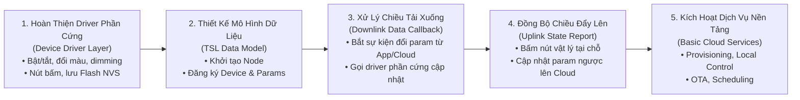
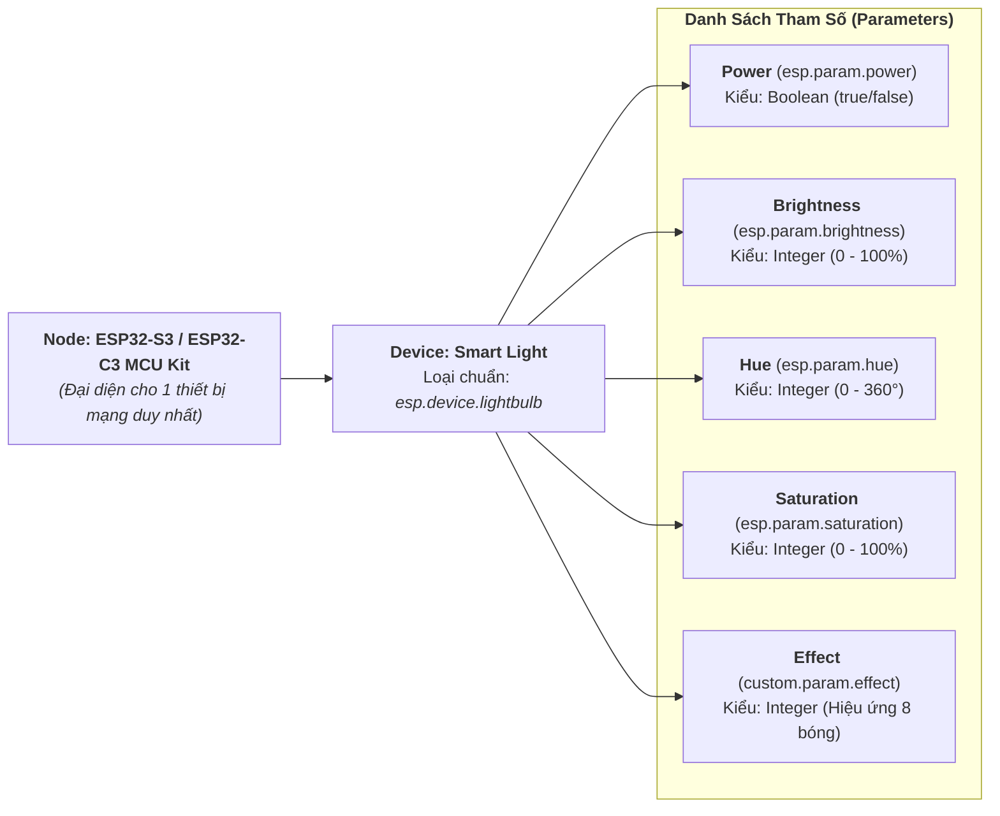
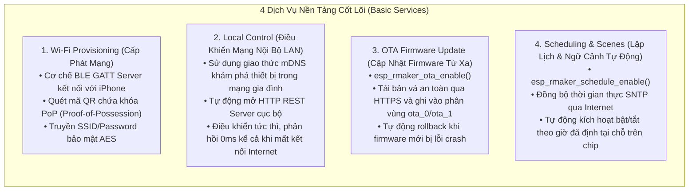
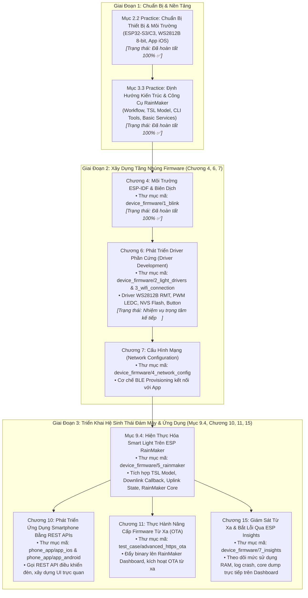

# Báo Cáo Tiến Trình: Mục 3.3 Phương Pháp Luận & Điểm Cốt Lõi Khi Phát Triển Với ESP RainMaker

> **Căn cứ tài liệu**: Mục *3.3 Practice: Key Points for Developing with ESP RainMaker* — Sách *ESP32-C3 Wireless Adventure: A Comprehensive Guide to IoT* (Espressif Systems).  
> **Dự án**: PBL5 - Hệ Thống Đèn Thông Minh Đa Mục Tiêu (ESP32-S3 & ESP32-C3).  
> **Thời gian cập nhật**: 16/09/2026.

---

## 1. Mục Đích & Bản Chất Của Mục 3.3 Practice

Mục **3.3 Practice: Key Points for Developing with ESP RainMaker** là phần thực hành mang tính chất **định hướng kiến trúc (Architectural Orientation)** và **chuẩn bị phương pháp luận phát triển (Development Methodology)** trước khi bước vào lập trình trực tiếp với ESP RainMaker ở các chương sau.

### Nguyên tắc chỉ đạo cốt lõi:
- **Chưa bắt tay vào nạp code RainMaker ngay**: Tránh tình trạng viết code kết nối Cloud khi tầng driver thiết bị bên dưới chưa hoàn thiện hoặc chưa ổn định.
- **Hiểu rõ luồng tương tác Cloud**: Định hình cách thức biến một tín hiệu phần cứng vật lý (xung RMT 800 kHz điều khiển đèn LED WS2812B) thành một thực thể số (**Node**, **Device**, **Parameter**) trên nền tảng đám mây.
- **Chuẩn bị sẵn sàng công cụ gỡ lỗi**: Làm quen với các công cụ tương tác trung gian (CLI, Swagger REST API) để có thể gỡ lỗi độc lập ở từng tầng.

---

## 2. Bốn Điểm Cốt Lõi Cần Xác Lập

### 2.1. Xác Lập Lộ Trình Phát Triển Chuẩn (Workflow)

Quy trình phát triển một sản phẩm IoT thương mại trên ESP RainMaker tuân thủ nghiêm ngặt theo 5 bước:



1. **Hoàn thiện tầng driver thiết bị phần cứng trước (Device Driver Layer)**:
   - Module `device_firmware/2_light_drivers` phải được lập trình và kiểm thử độc lập ở mức cục bộ. Đảm bảo thanh LED WS2812B 8-Bit NeoPixel hoạt động mượt mà, đổi màu chuẩn, không bị treo hoặc nhấp nháy trên cả hai dòng bo mạch (**ESP32-S3-DevKitC-1-N16R8** qua GPIO 4 và **ESP32-C3 DevKit** qua GPIO 5) trước khi gắn kết nối mạng.
2. **Định nghĩa mô hình TSL (Thing Specification Language)**:
   - Ánh xạ khả năng thực tế của đèn thành mô hình phân tầng: Node $\rightarrow$ Device $\rightarrow$ Parameters.
3. **Xử lý dữ liệu truyền từ Cloud xuống (Downlink Data)**:
   - Cài đặt hàm callback `write_cb`. Khi người dùng điều khiển trên App hoặc gửi lệnh API từ Cloud, RainMaker SDK sẽ nhận gói JSON, bóc tách giá trị param và chuyển giao cho driver phần cứng thi hành.
4. **Báo cáo trạng thái ngược lên Cloud (Uplink Report)**:
   - Khi có sự kiện vật lý xảy ra tại chỗ (nhấn nút Boot GPIO 0/9 để toggle đèn), firmware gọi `esp_rmaker_param_update_and_report()` để thông báo trạng thái mới nhất lên Cloud, giúp màn hình App trên điện thoại tự động nhảy trạng thái đồng bộ.
5. **Kích hoạt các dịch vụ cơ bản của RainMaker**.

---

### 2.2. Mô Hình Dữ Liệu TSL Cho Đèn Thông Minh (Thing Specification Language)

Mô hình dữ liệu số của thanh đèn LED WS2812B 8-Bit trên nền tảng ESP RainMaker được chuẩn hóa như sau:



| Tên Tham Số | Tên Chuẩn ESP RainMaker | Kiểu Dữ Liệu | Dải Giá Trị Hợp Lệ | Quyền Hạn | Mô Tả Chức Năng |
| :--- | :--- | :--- | :--- | :---: | :--- |
| **Nguồn (Power)** | `ESP_RMAKER_PARAM_POWER` | `bool` | `true` (Bật), `false` (Tắt) | Đọc / Ghi | Bật hoặc tắt toàn bộ thanh đèn LED |
| **Độ sáng (Brightness)** | `ESP_RMAKER_PARAM_BRIGHTNESS`| `int` | `0` $\sim$ `100` (%) | Đọc / Ghi | Điều chỉnh cường độ phát sáng |
| **Góc màu (Hue)** | `ESP_RMAKER_PARAM_HUE` | `int` | `0` $\sim$ `360` (độ) | Đọc / Ghi | Chọn tông màu trong không gian màu HSV |
| **Độ bão hòa (Saturation)**| `ESP_RMAKER_PARAM_SATURATION`| `int` | `0` $\sim$ `100` (%) | Đọc / Ghi | Chỉnh độ đậm nhạt của màu sắc |
| **Hiệu ứng (Effect)** | `custom.param.effect` | `int` | `0: Đơn sắc`, `1: Cầu vồng (Rainbow)`, `2: Thở (Breathing)`, `3: Đuổi (Marquee)` | Đọc / Ghi | Khai thác tối đa khả năng điều khiển độc lập 8 bóng của thanh WS2812B |

---

### 2.3. Chuẩn Bị Công Cụ Gỡ Lỗi (Debugging Tools)

Trong quá trình phát triển, việc chỉ dựa vào điện thoại để test rất bất tiện và khó tìm nguyên nhân khi có lỗi. RainMaker cung cấp 2 công cụ gỡ lỗi độc lập:

#### 1. Công cụ Dòng lệnh RainMaker CLI (`esp-rainmaker-cli`):
- **Cài đặt**: Chạy thông qua môi trường Python của máy tính:
  ```bash
  pip install esp-rainmaker-cli
  ```
- **Xác thực tài khoản**: Đăng nhập bằng cùng tài khoản đang dùng trên app iPhone:
  ```bash
  rainmaker login
  ```
- **Các lệnh test nhanh thường dùng**:
  - Liệt kê toàn bộ thiết bị đã kết nối:
    ```bash
    rainmaker getnodes
    ```
  - Xem cấu hình TSL (Node Config) để kiểm tra các device và parameter đã đăng ký:
    ```bash
    rainmaker getnodeconfig <node_id>
    ```
  - Đọc trạng thái thời gian thực của đèn:
    ```bash
    rainmaker getparams <node_id>
    ```
  - Bắn lệnh điều khiển trực tiếp từ Terminal để kiểm tra phản hồi của firmware:
    ```bash
    rainmaker setparams <node_id> '{"Smart Light": {"Power": true, "Brightness": 75, "Hue": 120}}'
    ```

#### 2. Giao diện Swagger REST API:
- Truy cập trực tiếp tại: [https://swagger.rainmaker.espressif.com/](https://swagger.rainmaker.espressif.com/)
- Cho phép gửi trực tiếp các yêu cầu HTTP HTTPS (GET/POST/PUT) tới máy chủ AWS Cloud của Espressif, lấy mã token xác thực (Access Token), xem phản hồi JSON thô để đối chiếu với logic của App điện thoại.

---

### 2.4. Nắm Rõ Cơ Chế Dịch Vụ Nền Tảng (Basic Services)

Để một chiếc đèn thông minh đạt tiêu chuẩn thương mại, sản phẩm cần bật 4 dịch vụ cốt lõi đi kèm trong RainMaker:



---

## 3. Bản Đồ Định Vị Kỹ Thuật Toàn Diện Cho Các Chương Tiếp Theo

Mục 3.3 đóng vai trò là "chiếc la bàn" định hướng cho toàn bộ các phần thực hành chuyên sâu phía sau:



---

## 4. Đánh Giá Trạng Thái: Chúng Ta Đã Xác Định Đầy Đủ Chưa?

Đối chiếu toàn diện giữa 4 yêu cầu của Mục 3.3 và hiện trạng dự án:

| Yêu Cầu Của Mục 3.3 Practice | Nội Dung Đã Xác Lập | Trạng Thái | Đánh Giá Kỹ Thuật |
| :--- | :--- | :---: | :--- |
| **1. Lộ trình làm việc (Workflow)** | Xác định nguyên tắc ưu tiên hoàn thiện Driver phần cứng trước (Chương 6) rồi mới tới TSL, Downlink callback và kích hoạt dịch vụ | ✅ **ĐÃ XÁC ĐỊNH ĐẦY ĐỦ** | Lộ trình chuẩn xác, tránh lỗi phụ thuộc chéo giữa Cloud và Phần cứng |
| **2. Công cụ gỡ lỗi (Debugging Tools)** | Nắm rõ cách sử dụng RainMaker CLI (`esp-rainmaker-cli`) và Swagger REST API | ✅ **ĐÃ XÁC ĐỊNH ĐẦY ĐỦ** | Sẵn sàng cài đặt và chạy test từ Terminal máy tính khi kết nối Cloud |
| **3. Mô hình dữ liệu TSL** | Thiết kế chi tiết Node, Device, các Param tiêu chuẩn (`Power`, `Brightness`, `Hue`, `Saturation`) và Param mở rộng (`Effect` cho 8-bit WS2812B) | ✅ **ĐÃ XÁC ĐỊNH ĐẦY ĐỦ** | Đảm bảo tương thích hoàn hảo cả App điện thoại lẫn Cloud Schema |
| **4. Các dịch vụ cơ bản (Basic Services)** | Xác định rõ 4 dịch vụ: Provisioning, Local Control (LAN), OTA Update, Scheduling | ✅ **ĐÃ XÁC ĐỊNH ĐẦY ĐỦ** | Đã sẵn sàng các API kích hoạt tương ứng |
| **5. Định vị các chương tiếp theo (9.4, 10, 11, 15)** | Ánh xạ chính xác từng chương sách tới từng thư mục mã nguồn tương ứng trong repository | ✅ **ĐÃ XÁC ĐỊNH ĐẦY ĐỦ** | Tầm nhìn dự án rõ ràng, không bị chồng chéo hay nhầm lẫn cấu trúc |

---

## 5. Kết Luận & Hành Động Tiếp Theo

Chúng ta đã **xác định đầy đủ 100%** toàn bộ các điểm cốt lõi, phương pháp luận và lộ trình phát triển của Mục 3.3 Practice.

### Bước hành động tiếp theo:
Theo đúng lộ trình Workflow đã xác lập ở Mục 3.3: **Chưa viết code RainMaker ngay**, mà chuyển thẳng sang **Chương 6 (Driver Development)**:
- Tập trung vào thư mục `device_firmware/2_light_drivers`.
- Nâng cấp mã nguồn lên chuẩn ESP-IDF v6 (thay thế timer cũ bằng `esp_timer`/`gptimer`).
- Xây dựng driver điều khiển **Thanh LED WS2812B 8-Bit NeoPixel** qua ngoại vi RMT (trên chân GPIO 4 cho **ESP32-S3-DevKitC-1-N16R8** và GPIO 5 cho **ESP32-C3 DevKit**).

