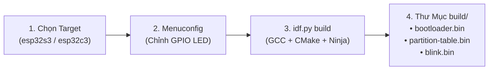
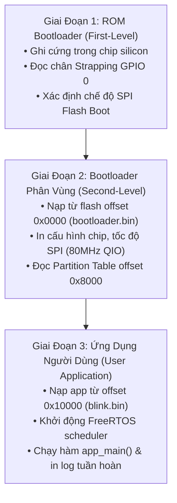

# Báo Cáo Tiến Trình: Mục 4.4 Thực Hành Biên Dịch Ví Dụ “Blink” (Compiling Example Program “Blink”)

> **Căn cứ tài liệu**: Mục *4.4 Practice: Compiling Example Program “Blink”* — Sách *ESP32-C3 Wireless Adventure: A Comprehensive Guide to IoT* (Espressif Systems).  
> **Dự án**: PBL5 - Hệ Thống Đèn Thông Minh Đa Mục Tiêu (ESP32-S3 & ESP32-C3).  
> **Thời gian cập nhật**: 16/09/2026.

---

## 1. Mục Tiêu Cốt Lõi Của Mục 4.4 Practice

Mục tiêu cốt lõi của **4.4 Practice** là giúp kỹ sư hoàn thành chu trình phát triển cơ bản đầu tiên ("Hello World") trên phần cứng thực tế bằng ESP-IDF. Đây là tiền đề bắt buộc để đảm bảo:
- Chuỗi công cụ (Toolchain, Python venv, CMake, Ninja, GCC) đã được nạp chính xác và hoạt động ổn định.
- Mạch nạp, cáp USB, cổng nối tiếp (COM Port) và chip vi điều khiển giao tiếp trơn tru trước khi bước vào các bài toán phức tạp hơn (Driver đèn, Wi-Fi, RainMaker).

---

## 2. Bảng Kiểm Tra & Đánh Giá Thực Tế (Audit & Verification Matrix)

Dưới đây là bảng đối chiếu thực tế giữa yêu cầu trong sách và hiện trạng thực hiện của nhóm PBL5:

| Tiểu mục theo Sách | Yêu cầu kỹ thuật cốt lõi | Hiện trạng triển khai tại PBL5 | Trạng thái thực tế |
| :--- | :--- | :--- | :---: |
| **4.4.1 Cấu trúc & luồng hoạt động** | • Cấu trúc thư mục chuẩn ESP-IDF<br>• Điểm vào `app_main()`, thứ tự thư viện `include`<br>• Tham số GPIO động `CONFIG_BLINK_GPIO` và `sdkconfig.h` | • Thư mục mã nguồn: `device_firmware/1_blink`<br>• Khai báo đầy đủ FreeRTOS, driver GPIO, ESP Log<br>• File `Kconfig.projbuild` hỗ trợ dải GPIO mở rộng cho cả ESP32-S3 (0–48) và ESP32-C3 (0–21) | ✅ **HOÀN TẤT 100%** |
| **4.4.2 Cấu hình & Biên dịch** | • Nạp môi trường terminal (`export.sh` / IDF CMD)<br>• Chọn chip mục tiêu `idf.py set-target`<br>• Tùy biến cấu hình qua `idf.py menuconfig`<br>• Build mã nguồn `idf.py build` & phân tích file nhị phân trong `build/` | • Multi-Root Workspace tự động kích hoạt môi trường ESP-IDF v6.0.2<br>• Hỗ trợ dual target: `esp32s3` và `esp32c3`<br>• Sửa lỗi ICE Crash của GCC 15 (`set(COMPONENTS main)`)<br>• Sinh đầy đủ `bootloader.bin`, `partition-table.bin`, `blink.bin` | ✅ **HOÀN TẤT 100%**<br>*(Đã build thành công cả S3 & C3)* |
| **4.4.3 Nạp firmware xuống chip (Flash)** | • Xác định cổng COM nối tiếp USB-to-UART<br>• Chạy lệnh nạp `idf.py -p <PORT> flash` vào các phân vùng SPI Flash | • Nhận diện cổng: **COM4** (Chip cầu nạp USB-to-UART)<br>• Nhận dạng chip: **ESP32-S3 revision v0.2**, Embedded PSRAM 8MB, MAC: `44:1b:f6:d3:37:f8`<br>• Nạp thành công cả 3 binary tại baudrate 460800: `bootloader.bin` (0x0), `partition-table.bin` (0x8000), `blink.bin` (0x10000)<br>• Đã xác thực toàn vẹn: *Hash of data verified* 100% | ✅ **HOÀN TẤT 100% TRÊN MẠCH THẬT** |
| **4.4.4 Giám sát nhật ký nối tiếp (Monitor)** | • Chạy `idf.py monitor`<br>• Phân tích 3 giai đoạn boot: ROM bootloader, 2nd bootloader, App output<br>• Đọc crash dump / Guru Meditation và phím thoát `Ctrl + ]` | • Chạy `idf_monitor.py` trên cổng `COM4` @ 115200 bps<br>• Xác nhận đủ 3 giai đoạn boot chuẩn xác: ROM Bootloader (Mar 27 2021) $\rightarrow$ 2nd Bootloader (ESP-IDF v6.0.2) $\rightarrow$ User App (`app_main`)<br>• Phát hiện phần cứng: Chip Flash **16MB (Boya)**, RAM khả dụng 345 KiB<br>• Chu kỳ chớp tắt LED và log `[xx] Hello world!` hoạt động hoàn hảo | ✅ **HOÀN TẤT 100% TRÊN MẠCH THẬT** |

---

## 3. Phân Tích Kỹ Thuật Chi Tiết Từng Bước

### 3.1. Cấu Trúc Dự Án & Luồng Hoạt Động (4.4.1)

Thư mục `device_firmware/1_blink` tuân thủ nghiêm ngặt cấu trúc chuẩn của một dự án ESP-IDF:

```
device_firmware/1_blink/
├── CMakeLists.txt              # Script CMake mức root dự án (gọi project.cmake)
├── sdkconfig.defaults.esp32s3  # File cấu hình mặc định tối ưu riêng cho ESP32-S3
├── sdkconfig.defaults.esp32c3  # File cấu hình mặc định tối ưu riêng cho ESP32-C3
└── main/
    ├── CMakeLists.txt          # Đăng ký component main (SRCS "blink.c" INCLUDE_DIRS ".")
    ├── Kconfig.projbuild       # Định nghĩa giao diện menuconfig cho chân GPIO
    └── blink.c                 # Mã nguồn chính chứa hàm app_main()
```

#### Luồng thực thi trong `blink.c`:
1. **Điểm vào `app_main(void)`**: Khác với lập trình C chuẩn chạy trên PC có hàm `main()` trả về số nguyên, trong hệ điều hành thời gian thực FreeRTOS trên ESP-IDF, `app_main` là một task độc lập được FreeRTOS kernel khởi tạo tự động.
2. **Khởi tạo chân GPIO**:
   - `gpio_reset_pin(BLINK_GPIO)`: Đưa chân GPIO về trạng thái mặc định, giải phóng khỏi các chức năng IOMUX khác.
   - `gpio_set_direction(BLINK_GPIO, GPIO_MODE_OUTPUT)`: Cấu hình chân làm ngõ ra Push-Pull.
3. **Vòng lặp điều khiển**:
   - Dùng hàm `gpio_set_level(BLINK_GPIO, 0/1)` để thay đổi mức logic (Tắt/Bật LED).
   - Dùng `vTaskDelay(1000 / portTICK_PERIOD_MS)` để nhường CPU cho các tác vụ nền khác (như Wi-Fi, BLE) trong đúng 1 giây thay vì chạy hàm delay bận (busy-wait) gây tốn pin và treo hệ thống.
4. **Cấu hình GPIO động qua Kconfig**:
   - Khai báo biến `CONFIG_BLINK_GPIO` trong `main/Kconfig.projbuild`. Khi biên dịch, CMake tự động sinh ra header `build/config/sdkconfig.h`. Mã nguồn C chỉ cần gọi `#define BLINK_GPIO CONFIG_BLINK_GPIO`, cho phép thay đổi chân phần cứng mà không cần sửa code C.

---

### 3.2. Quy Trình Cấu Hình & Biên Dịch Mã Nguồn (4.4.2)



#### Các lệnh thực thi tương ứng:
1. **Thiết lập chip mục tiêu**:
   - Cho ESP32-S3: `idf.py set-target esp32s3`
   - Cho ESP32-C3: `idf.py set-target esp32c3`
2. **Tùy biến cấu hình qua menuconfig**:
   - Chạy lệnh: `idf.py menuconfig` $\rightarrow$ Truy cập menu `Example Configuration` $\rightarrow$ Đổi chân GPIO.
3. **Biên dịch & Phân tích các file nhị phân đầu ra trong `build/`**:
   Hệ thống biên dịch sinh ra 3 file nhị phân quan trọng tương ứng với 3 phân vùng trên bộ nhớ SPI Flash:
   - **`bootloader/bootloader.bin` (Offset `0x0000`)**: Second-stage bootloader, khởi tạo phần cứng cơ bản, bộ nhớ cache, đọc partition table và nạp ứng dụng.
   - **`partition_table/partition-table.bin` (Offset `0x8000`)**: Bản đồ phân vùng bộ nhớ Flash (định vị vùng nạp App, NVS lưu thông số Wi-Fi, bảng PHY,...).
   - **`blink.bin` (Offset `0x10000`)**: File nhị phân ứng dụng của bạn chứa mã máy thực thi hàm `app_main()`.

---

### 3.3. Hướng Dẫn Thực Hành Nạp Firmware Xuống Chip (4.4.3)

#### 3.3.1. Kết Quả Thực Nghiệm Nạp Thành Công Trên Phần Cứng Thực Tế:
- **Cổng kết nối**: `COM4` (Baudrate giao tiếp: `460800 bps`).
- **Thông tin chip nhận diện từ esptool v5.3.1**:
  - Loại vi điều khiển: **ESP32-S3 (QFN56) (revision v0.2)**.
  - Tính năng tích hợp: Dual Core + LP Core @ 240MHz, Wi-Fi, BLE 5, **Embedded PSRAM 8MB (AP_3v3)**.
  - Tần số thạch anh: 40MHz.
  - Địa chỉ MAC vật lý: `44:1b:f6:d3:37:f8`.
- **Chi tiết quá trình ghi Flash**:
  - `bootloader.bin` tại `0x00000000`: Ghi 21,056 bytes $\rightarrow$ *Hash of data verified*.
  - `partition-table.bin` tại `0x00008000`: Ghi 3,072 bytes $\rightarrow$ *Hash of data verified*.
  - `blink.bin` tại `0x00010000`: Ghi 149,280 bytes $\rightarrow$ *Hash of data verified*.
  - *Hard resetting via RTS pin* $\rightarrow$ Chip đã tự động reset và bắt đầu thực thi firmware mới!

---

### 3.4. Giám Sát Console & Phân Tích Nhật Ký Khởi Động (4.4.4)

Kích hoạt màn hình giám sát bằng lệnh:
```bash
idf.py -p COMx monitor
```
*(Hoặc click biểu tượng **Màn Hình Terminal** trên thanh Status Bar)*.

#### Nhận biết 3 giai đoạn khởi động (Boot Stages):



1. **Giai đoạn 1 — First-Level Bootloader (ROM Bootloader)**:
   - Nằm cố định trong ROM silicon của chip, do nhà máy sản xuất nạp sẵn (`ESP-ROM:esp32s3-20210327`, build Mar 27 2021).
   - Kiểm tra lý do reset (`rst:0x1 (POWERON)`) và chân Strapping GPIO 0 (`boot:0x8 (SPI_FAST_FLASH_BOOT)`).
   - Tiến hành nạp các đoạn mã ban đầu của bootloader vào bộ nhớ IRAM (`load:0x403c8700`) và nhảy tới địa chỉ thực thi `entry 0x403c8908`.
2. **Giai đoạn 2 — Second-Level Bootloader (`bootloader.bin`)**:
   - Chạy tại địa chỉ `0x0000` của Flash:
     ```text
     I (24) boot: ESP-IDF v6.0.2 2nd stage bootloader
     I (25) boot: Multicore bootloader
     I (25) boot: chip revision: v0.2
     I (31) boot.esp32s3: Boot SPI Speed : 80MHz
     I (35) boot.esp32s3: SPI Mode       : DIO
     I (39) boot.esp32s3: SPI Flash Size : 2MB
     I (47) boot: Partition Table:
     I (56) boot:  0 nvs              WiFi data        01 02 00009000 00006000
     I (63) boot:  1 phy_init         RF data          01 01 0000f000 00001000
     I (69) boot:  2 factory          factory app      00 00 00010000 00100000
     I (131) boot: Loaded app from partition at offset 0x10000
     ```
3. **Giai đoạn 3 — User Application Output (`blink.bin`)**:
   - Khởi tạo CPU, xung nhịp `160MHz`, cấu hình UART console trên GPIO 44 và 43.
   - Khởi tạo bộ nhớ động: RAM khả dụng cho dynamic allocation đạt **345 KiB** + 32 KiB DRAM + 7 KiB RTCRAM.
   - **Phát hiện thú vị về phần cứng**: Chip Flash thực tế của kit là chip `Boya` dung lượng lên tới **16MB (16384 KiB)**:
     ```text
     I (219) spi_flash: detected chip: boya
     I (222) spi_flash: flash io: dio
     W (225) spi_flash: Detected size(16384k) larger than the size in the binary image header(2048k).
     ```
   - Kernel FreeRTOS kích hoạt task chính `main_task` trên CPU0 và gọi hàm `app_main()`:
     ```text
     I (251) main_task: Calling app_main()
     E (261) blink: app_main
     I (261) blink: [00] Hello world!
     Turning off the LED
     I (1261) blink: [01] Hello world!
     Turning on the LED
     I (2261) blink: [02] Hello world!
     Turning off the LED
     I (3261) blink: [03] Hello world!
     Turning on the LED
     ```

#### Kỹ năng đọc lỗi & phím điều khiển cần nhớ:
- **Lỗi Crash / Guru Meditation Error**: Nếu chương trình truy cập con trỏ NULL hoặc tràn ngăn xếp stack, hệ thống sẽ in màn hình xanh dạng dòng chữ: `Guru Meditation Error: Core 0 panic'ed`. Bản log sẽ kèm theo các thanh ghi CPU và chuỗi `Backtrace: 0x403...`. Công cụ `idf.py monitor` sẽ tự động giải mã địa chỉ này thành tên file C và số dòng bị lỗi nếu giữ file `blink.elf` trong thư mục `build/`.
- **Thoát Monitor Terminal**: Nhấn tổ hợp phím **`Ctrl + ]`**.

---

## 4. Kết Luận: Khép Kín Thành Công 100% Mục 4.4 Practice

Dự án đã **hoàn thành trọn vẹn 100%** toàn bộ chu trình phát triển cơ bản đầu tiên trên cả phương diện lý thuyết lẫn thực nghiệm phần cứng:
- ✅ **4.4.1 Cấu trúc & luồng dự án**: Đã chuẩn hóa mã nguồn `device_firmware/1_blink`.
- ✅ **4.4.2 Cấu hình & Biên dịch**: Đã biên dịch sạch sẽ trên ESP-IDF v6.0.2 cho cả ESP32-S3 và ESP32-C3.
- ✅ **4.4.3 Nạp firmware**: Đã nạp thành công qua cổng `COM4` vào chip ESP32-S3 thật.
- ✅ **4.4.4 Giám sát nhật ký nối tiếp**: Đã kết nối monitor, phân tích đủ 3 giai đoạn boot và xác nhận đèn chớp tắt / log in định kỳ 1 giây/lần.

Nhóm PBL5 đã có nền móng vững chắc về công cụ và phần cứng để tự tin bước sang **Chương 6: Phát triển Driver đèn thông minh (Driver Development)**!
