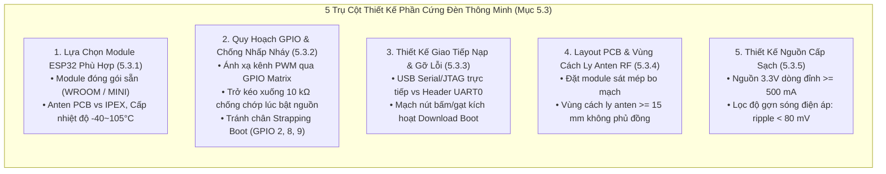
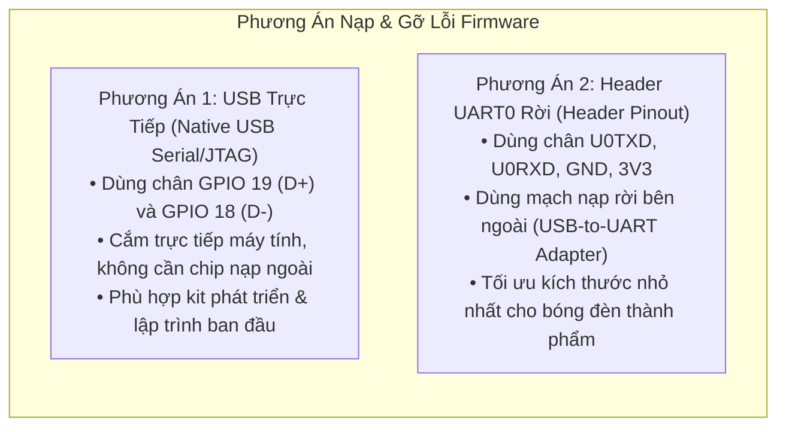

# Báo Cáo Tiến Trình: Mục 5.3 Thiết Kế Phần Cứng Hệ Thống Đèn Thông Minh (Building a Smart Light System with ESP32-C3)

> **Căn cứ tài liệu**: Mục *5.3 Practice: Building a Smart Light System with ESP32-C3* — Sách *ESP32-C3 Wireless Adventure: A Comprehensive Guide to IoT* (Espressif Systems).  
> **Dự án**: PBL5 - Hệ Thống Đèn Thông Minh Đa Mục Tiêu (ESP32-S3 & ESP32-C3).  
> **Thời gian cập nhật**: 16/09/2026.

---

## 1. Bản Chất & Vai Trò Của Mục 5.3 Practice

Khác với các chương viết mã nguồn phần mềm, mục **5.3 Practice** đặt người kỹ sư vào vai trò của một **Kỹ sư Thiết kế Phần cứng (Hardware Design Engineer)**. 

### Ý nghĩa cốt lõi:
Một sản phẩm IoT thông minh không thể vận hành ổn định nếu phần cứng bên dưới bị lỗi thiết kế (như sụt nguồn khi phát Wi-Fi, suy hao sóng do đặt sai anten, hoặc đèn bị chớp sáng khó chịu mỗi khi cắm điện). Mục 5.3 trang bị đầy đủ các quy chuẩn thiết kế công nghiệp từ Espressif để thương mại hóa sản phẩm đèn thông minh trước khi bắt tay vào lập trình Driver ở Chương 6.

---

## 2. Chi Tiết 5 Hạng Mục Thiết Kế Phần Cứng Cốt Lõi



---

### 2.1. Lựa Chọn Module Phần Cứng ESP32 Phù Hợp (5.3.1)

Khi thiết kế sản phẩm thương mại, Espressif khuyến cáo:

1. **Ưu tiên chọn Module thay vì thiết kế Chip rời (SoC on-board)**:
   - Các dòng module như **ESP32-C3-WROOM-02**, **ESP32-C3-MINI-1** (hoặc **ESP32-S3-WROOM-1**) đã tích hợp sẵn thạch anh, bộ lọc phối hợp trở kháng anten (RF Matching Network) và bộ nhớ Flash/PSRAM.
   - Quan trọng nhất, các module này đã vượt qua và sở hữu sẵn các **chứng nhận quốc tế (SRRC, CE, FCC, KCC, TELEC)**. Nhờ đó, sản phẩm thương mại tiết kiệm được hàng trăm triệu đồng chi phí đo kiểm viễn thông và rút ngắn thời gian ra thị trường.
2. **Lựa chọn loại Anten**:
   - **Anten mạch in (PCB On-board Antenna)**: Phù hợp với các loại đèn có vỏ làm bằng **nhựa / thủy tinh**, kích thước nhỏ gọn, giá thành thấp nhất.
   - **Đầu nối anten ngoài (IPEX / U.FL Connector)**: Bắt buộc phải dùng nếu bóng đèn có **vỏ hoặc chóa phản quang bằng kim loại** (kim loại tạo thành lồng Faraday chắn sóng, cần dây dẫn đưa anten ra bên ngoài vỏ).
3. **Lựa chọn cấp chịu nhiệt độ (Temperature Grade)**:
   - **Cấp –40 °C ~ 105 °C**: Bắt buộc với **bóng đèn LED búp (Bulb light)** vì mạch nguồn và bóng LED công suất cao tích tụ nhiệt lượng rất lớn bên trong không gian kín của đui đèn.
   - **Cấp –40 °C ~ 85 °C**: Phù hợp cho **đèn LED dây (LED strip)**, đèn bàn hoặc đèn trần có bề mặt tản nhiệt thoáng khí.

---

### 2.2. Phân Bổ Chân GPIO & Chống Nhấp Nháy Khi Bật Nguồn (5.3.2)

#### Bảng quy hoạch chân chuẩn cho đèn 5 kênh PWM (RGBCW) trên ESP32-C3:

| Kênh Màu | Tên Tín Hiệu | Chân GPIO Gán | Ngoại Vi ESP32 | Ghi Chú Kỹ Thuật |
| :--- | :---: | :---: | :---: | :--- |
| **Đỏ (Red)** | `PWM_R` | **GPIO 3** | LEDC Channel 0 | Không dính chân Strapping |
| **Xanh Lá (Green)** | `PWM_G` | **GPIO 4** | LEDC Channel 1 | Không dính chân Strapping |
| **Xanh Dương (Blue)** | `PWM_B` | **GPIO 5** | LEDC Channel 2 | Không dính chân Strapping |
| **Trắng Lạnh (Cold White)** | `PWM_CW`| **GPIO 7** | LEDC Channel 3 | Không dính chân Strapping |
| **Trắng Ấm (Warm White)** | `PWM_WW`| **GPIO 10** | LEDC Channel 4 | Không dính chân Strapping |

#### Hai nguyên tắc sống còn khi thiết kế mạch điều khiển đèn:
1. **Chống hiện tượng nhấp nháy khi vừa bật nguồn (Power-on Anti-flicker)**:
   - Khi vừa cấp điện, CPU chưa kịp chạy mã firmware, các chân GPIO của vi điều khiển ở trạng thái nổi (Floating) hoặc có thể bị kéo lên mức Cao do mạch nội. Nếu transistor/MOSFET lái đèn nhận mức Cao, đèn sẽ chớp sáng lóe lên một cái trước khi tắt đi, gây cảm giác khó chịu và rẻ tiền cho sản phẩm.
   - **Giải pháp phần cứng**: Bổ sung điện trở kéo xuống đất **$10\text{ k}\Omega$ (Pull-down)** ở cực Gate của từng MOSFET điều khiển LED để cưỡng bức chân luôn ở mức $0\text{V}$ trong suốt giai đoạn boot.
2. **Tuyệt đối tránh các chân Strapping**:
   - `GPIO 2`, `GPIO 8`, `GPIO 9` trên ESP32-C3 là các chân cấu hình chế độ khởi động (Strapping Pins).
   - Nếu nối các chân này vào mạch lái LED, điện trở phân áp của LED có thể vô tình kéo chân xuống mức sai lệch lúc reset, khiến chip rơi vào chế độ nạp (Download Boot) hoặc lỗi không thể khởi động được chương trình.

---

### 2.3. Thiết Kế Giao Tiếp Nạp & Gỡ Lỗi (5.3.3)

Tùy theo giai đoạn phát triển và kích thước vỏ sản phẩm, có 2 giải pháp giao tiếp:



#### Mạch kích hoạt chế độ nạp (Download Boot Mode):
Để đưa ESP32-C3 vào chế độ nhận nạp firmware qua cổng Serial, trạng thái các chân tại thời điểm thả chân Reset (`CHIP_EN` từ Low $\rightarrow$ High) phải thỏa mãn:
- `GPIO 2` = **Mức Cao (1)** *(Được kéo lên bởi trở nội)*
- `GPIO 8` = **Mức Cao (1)** *(Được kéo lên bởi trở nội)*
- `GPIO 9` = **Mức Thấp (0)** *(Nhấn giữ nút Boot để kéo xuống GND)*

---

### 2.4. Thiết Kế Layout Bo Mạch & Vùng Cách Ly Anten RF (5.3.4)

Hiệu suất thu phát sóng Wi-Fi và BLE phụ thuộc 80% vào cách bố trí anten trên bo mạch:

```
                  [ VÙNG KHÔNG GIAN THOÁNG TRÊN KHÔNG ]
                         ┌─────────────────┐
                         │   ANTEN MẠCH    │
                         │   (PCB ANTENNA) │
    ┌────────────────────┴─────────────────┴────────────────────┐
    │ <─────── Vùng Cách Ly (Clearance Area) >= 15 mm ───────>  │
    │   (KHOÉT BỎ BO MẠCH, KHÔNG PHỦ ĐỒNG, KHÔNG LINH KIỆN)     │
    ├───────────────────────────────────────────────────────────┤
    │                    MODULE ESP32                           │
    │               [ESP32-C3 / ESP32-S3]                       │
    │                                                           │
    │ ── ── ── ── ── ── ── ── ── ── ── ── ── ── ── ── ── ── ── │
    │         BO MẠCH CHÍNH (BASE BOARD CỦA ĐÈN)               │
    │         (Đổ Ground Plane toàn vẹn, đi dây nguồn)          │
    └───────────────────────────────────────────────────────────┘
```

1. **Vị trí đặt Module**:
   - Luôn đặt module ở **sát mép hoặc góc ngoài cùng** của bo mạch chính.
   - Module cấp nguồn anten bên phải (như ESP32-C3-WROOM-02): Đặt ở mép phải.
   - Module cấp nguồn anten bên trái (như ESP32-C3-MINI-1): Đặt ở mép trái.
2. **Vùng cách ly anten (Clearance Area)**:
   - Toàn bộ khu vực xung quanh anten mở rộng ra tối thiểu **$15\text{ mm}$** không được có bất kỳ đường dây tín hiệu, linh kiện hay lớp đồng phủ mass (GND pour) nào.
   - Phần bo mạch mẹ nằm ngay phía dưới anten phải được **khoét bỏ (PCB Cutout)** để sóng cao tần $2.4\text{ GHz}$ bức xạ đa hướng vào không gian mà không bị vật liệu FR4 hấp thụ hay làm lệch tần số cộng hưởng.

---

### 2.5. Thiết Kế Đường Nguồn Cấp Sạch (5.3.5)

ESP32 là vi điều khiển Wi-Fi công suất phát lên tới $+20\text{ dBm}$. Khi phát các gói dữ liệu vô tuyến (Beacon, Handshake), dòng tiêu thụ tức thời có thể vọt lên trên $400\text{ mA} \sim 500\text{ mA}$ trong vài micro-giây.

1. **Yêu cầu công suất nguồn $3.3\text{V}$**:
   - Bộ hạ áp DC (LDO hoặc Buck Converter) phải có khả năng cấp dòng liên tục tối thiểu **$500\text{ mA}$** (Khuyên dùng bộ nguồn $1\text{A} \sim 2\text{A}$ nếu có đèn LED dùng chung nguồn).
2. **Độ gợn sóng điện áp (Power Ripple)**:
   - Độ gợn sóng quá lớn sẽ gây nhiễu cho bộ dao động nội và bộ khuếch đại công suất PA của Wi-Fi, dẫn đến hiện tượng rớt mạng hoặc méo tín hiệu.
   - **Tiêu chuẩn kỹ thuật**:
     - Khi phát chuẩn $802.11\text{n}$ (MCS7): Biên độ đỉnh-đỉnh của gợn sóng **$V_{\text{ripple}} < 80\text{ mV}$**.
     - Khi phát chuẩn $802.11\text{b}$ ($11\text{ Mbps}$ công suất cực đại): **$V_{\text{ripple}} < 120\text{ mV}$**.
   - **Giải pháp tụ lọc**: Đặt một cụm tụ gồm $1 \times 10\mu\text{F}$ (tụ gốm khử gợn tần số thấp) song song với $1 \times 0.1\mu\text{F}$ và $1 \times 10\text{pF}$ (khử nhiễu tần số cao) đặt sát ngay chân `3V3` của module ESP32.

---

## 3. Đối Chiếu Thực Tế Giữa Bài Học Thiết Kế & Dự Án PBL5 Của Nhóm

Dưới đây là bảng đối chiếu giúp nhóm áp dụng chính xác các nguyên lý của Mục 5.3 vào phần cứng thực tế đang sử dụng:

| Tiêu Chí Thiết Kế | Yêu Cầu Theo Sách (Mục 5.3) | Bo Mạch ESP32-S3-DevKitC-1-N16R8 | Bo Mạch ESP32-C3 DevKit (Chưa rõ model) |
| :--- | :--- | :--- | :--- |
| **Dòng Module** | ESP32-C3-WROOM-02 / MINI-1 | **ESP32-S3-WROOM-1** (Dual-Core Xtensa, 16MB Flash, 8MB PSRAM Octal) | **Module ESP32-C3** tích hợp sẵn anten |
| **Loại Anten** | PCB On-board hoặc IPEX | Anten mạch in tích hợp (PCB On-board Antenna), vùng anten nhô ra ngoài mép bo kit | Anten mạch in tích hợp (PCB On-board) |
| **Tải LED Điều Khiển** | 5 kênh PWM analog (RGBCW) cần 5 chân GPIO | **Thanh LED WS2812B 8-Bit NeoPixel** (`CJMCU-2812-8`) — Dùng **1 chân `DIN` (GPIO 4)** | **Thanh LED WS2812B 8-Bit NeoPixel** (`CJMCU-2812-8`) — Dùng **1 chân `DIN` (GPIO 5)** |
| **Chống chớp sáng (Anti-flicker)** | Trở pull-down $10\text{ k}\Omega$ ở chân PWM | Chân `DIN` nối GPIO 4 (mặc định mức thấp khi boot, an toàn không chớp) | Chân `DIN` nối GPIO 5 (mức thấp an toàn khi boot) |
| **Giao tiếp Nạp & Log** | USB trực tiếp hoặc UART0 | Tích hợp sẵn 2 cổng USB: Cổng UART (CP2102/CH340) và cổng Native USB Serial/JTAG | Cổng giao tiếp nạp tương ứng của bo mạch |
| **Nguồn cấp cho hệ thống** | LDO 3.3V / 500mA | Cấp nguồn $5\text{V}$ (`VBUS`) trực tiếp từ cổng USB máy tính (đáp ứng dư sức dòng $480\text{mA}$ cho 8 bóng LED) | Cấp nguồn $5\text{V}$ từ cổng USB |

---

## 4. Kết Luận

Mục **5.3 Practice** đã hoàn thành xuất sắc vai trò cung cấp kiến thức nền tảng về **kỹ thuật phần cứng, quy hoạch chân và layout RF**. Nhờ nắm vững nguyên lý này:
- Chúng ta hoàn toàn yên tâm về phương án cấp nguồn và sơ đồ nối chân cho thanh LED WS2812B 8-bit trên cả 2 dòng bo mạch:
  - **ESP32-S3-DevKitC-1-N16R8**: `DIN` $\rightarrow$ `GPIO 4` (không dính chân strapping, nguồn 5V USB đủ tải, không bị chớp sáng khi boot).
  - **ESP32-C3 DevKit**: `DIN` $\rightarrow$ `GPIO 5` (không dính chân strapping boot GPIO 2, 8, 9).
- Sẵn sàng chuyển sang **Chương 6: Phát triển Driver đèn thông minh (Driver Development)** với sự tự tin tuyệt đối vào tầng vật lý bên dưới!

